# drawably

Hand-drawn UI controls. Every mount generates a fresh pen sketch from seeded
randomness, and the stroke boils like an animated doodle. Zero dependencies,
~3 KB of JS gzipped and one stylesheet.


## Install

```sh
npm i drawably
```

## Quick start

```js
import { drawablyButton } from "drawably";
import "drawably/style.css";

drawablyButton(document.querySelector("#done"), { variant: "solid" });
```

React:

```jsx
import { DrawablyButton } from "drawably/react";
import "drawably/style.css";

<DrawablyButton variant="solid" onClick={submit}>Done</DrawablyButton>
```

Each attach call returns a sketch handle:

```js
const sketch = drawablyButton(el);
sketch.resketch();     // redraw with a new random seed
sketch.resketch(42);   // redraw with a specific seed
sketch.destroy();      // remove the SVG and all listeners
```

## Buttons

Three variants: `outline` (default), `solid`, `scribble`. Buttons also carry a
state machine for async work:



```js
const button = drawablyButton(el);
button.setState("loading");  // dims the button, boils faster
button.setState("error");    // redraws in red
button.setState("success");  // redraws in green
button.setState("idle");
```

In React, pass the `state` prop; the sketch stays put and only the state
changes:

```jsx
<DrawablyButton state={saving ? "loading" : "idle"}>Save</DrawablyButton>
```

Override the state colours with `--drawably-error` and `--drawably-success`.
For secondary or destructive actions, set `tone: "neutral"` (warm grey) or
`tone: "danger"` (red).

## Controls

| Function | Element it expects |
| --- | --- |
| `drawablyButton(el, opts)` | a `<button>` |
| `drawablyCheckbox(el, opts)` | wrapper containing `<input type="checkbox">` |
| `drawablyRadio(el, opts)` | wrapper containing `<input type="radio">` |
| `drawablyToggle(el, opts)` | wrapper containing `<input type="checkbox">` |
| `drawablyInput(el, opts)` | wrapper containing an `<input>` |
| `drawablyDivider(el, opts)` | an `<hr>` or div |
| `drawablyCard(el, opts)` | any block element |

The real inputs stay in the DOM, so keyboard, forms, labels and screen readers
all work as usual. The sketch is an `aria-hidden` SVG layered underneath.

Every control has a React counterpart in `drawably/react`: `DrawablyButton`,
`DrawablyCheckbox`, `DrawablyRadio`, `DrawablyToggle`, `DrawablyInput`,
`DrawablyDivider`, `DrawablyCard`.

## Text decoration

Annotate copy the way you would with a pen. Each attaches to an inline element
and leaves its layout alone; use them on a word or a short phrase.

| Function | Draws |
| --- | --- |
| `drawablyUnderline(el, opts)` | a rough line under the text, re-sketched on hover |
| `drawablyHighlight(el, opts)` | a marker wash behind the text |
| `drawablyCircle(el, opts)` | a hand-drawn ellipse looping around the text |
| `drawablyArrow(from, to, opts)` | an arrow from one element to another |

```jsx
import { DrawablyUnderline, DrawablyHighlight, DrawablyCircle, DrawablyArrow } from "drawably/react";

<p>
  <DrawablyUnderline>Hand-drawn</DrawablyUnderline> UI, a{" "}
  <DrawablyHighlight>fresh sketch</DrawablyHighlight> on{" "}
  <DrawablyCircle>every mount</DrawablyCircle>.
</p>
<DrawablyArrow from={noteRef} to={buttonRef} />
```

The arrow's SVG is appended to `<body>` in document coordinates and redraws on
resize. Anchors inside a scrolling container will drift as it scrolls.

## Options

All controls take the same base options:

| Option | Default | What it does |
| --- | --- | --- |
| `seed` | random | Omit for a unique sketch per mount, pass a number for a reproducible one |
| `roughness` | `1` | Wobble of the base sketch |
| `boil` | `0.3` | Px of frame-to-frame flicker; `0` renders one static path |
| `stroke`, `fill`, `paper` | ink blue / white | Colours, set as `--drawably-*` custom properties |
| `width` | `2` | Stroke width in px |

The colours are plain CSS custom properties, so a theme can set them once:

```css
:root {
  --drawably-stroke: #1a1a1a;
  --drawably-fill: #1a1a1a;
}
```

Type is set in Inter when the page has it loaded (the library ships no font
files — load Inter yourself), falling back to `system-ui`.

## Motion

Strokes boil gently: three frames of the same sketch, micro-wobbled around a
shared base, cycled by pure CSS at 1200ms. Hover or press re-sketches buttons
and checkboxes. `prefers-reduced-motion` freezes everything to a single static
sketch — including the demo images above.

## Build your own shapes

The rough renderer is exported. Each function returns an SVG path string, and
`variants` produces the boil frames:

```js
import { roughRoundedRect, roughLine, roughCircle, variants } from "drawably";

const frames = variants(
  (o) => roughRoundedRect(0, 0, 200, 100, 12, o),
  { seed: 7, roughness: 1, boil: 0.3 },
);
// three path strings — render them and cycle opacity
```

Also exported: `roughEllipse`, `roughArrow`, `roughCheckmark`, `scribbleFill`,
and the seeded PRNG `mulberry32`.

## License

MIT.
